# MySecureApi - Secure Financial Management Web API

A robust **ASP.NET Core Web API** built with **.NET 8** and **Clean Architecture**.  
This project demonstrates my transition from Unity/C# game development to professional backend engineering, focusing on **maintainability, testability, security, and scalability**.

## Technical Highlights

- **Clean Architecture** – Fully decoupled layers (API, Application, Domain, Infrastructure)
- **Repository Pattern** + **Dependency Injection** – Clean separation of concerns
- **Entity Framework Core** – Secure data persistence with PostgreSQL / SQL Server
- **DTO Mapping** – Prevents over-posting and protects internal entities
- **Automated Unit Testing** – Comprehensive tests using **xUnit + Moq** (behavior & state verification)
- **Docker Support** – Ready for containerized deployment

## Project Structure
```bash
MySecureApi/
├── Api/                          # Controllers, Middleware, Program.cs
├── Application/                  # Services, DTOs, Business Logic, Validators
├── Domain/                       # Entities, Repository Interfaces (most stable layer)
├── Infrastructure/               # EF Core DbContext, Repository Implementations
├── MyFinanceApi.Tests/           # xUnit + Moq unit tests
├── docker-compose.yml            # Local development with PostgreSQL
└── README.md
```

## Getting Started

### Prerequisites
- .NET 8 SDK
- Docker (recommended)

### 1. Clone the repository
```bash
git clone https://github.com/lftfung/MySecureApi.git
cd MySecureApi
```
### 2. Restore dependencies
```bash
dotnet restore
```
### 3. Run with Docker (recommended)
```bash
docker-compose up --build
```
### 4. Run Unit Tests
```bash
dotnet test
```
### Unit Test Results
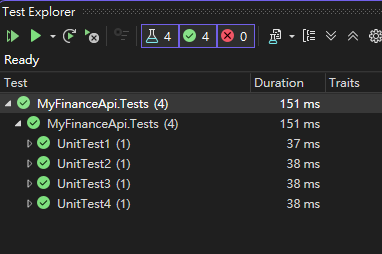

*Comprehensive unit tests using xUnit and Moq (all tests passing).*

### Swagger UI - API Endpoints
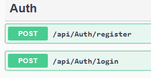

*Shows Authentication (Register & Login) and full Transaction CRUD endpoints.*

### Transaction Endpoint Example
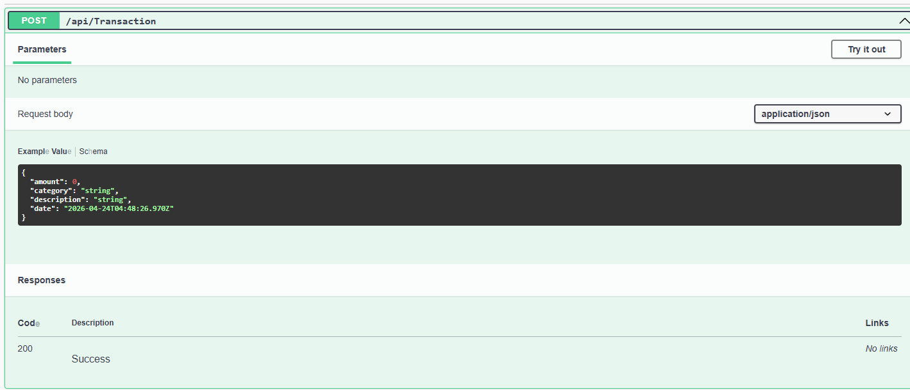

*Example of POST /api/Transaction with request body.*

## Testing
The project includes a dedicated test project with behavior verification for key services (e.g. TransactionService).

xUnit + Moq for mocking repositories
Tests cover CRUD operations, validation, and edge cases

## Tech Stack
Framework: .NET 8 + ASP.NET Core Web API
ORM: Entity Framework Core
Architecture: Clean Architecture + Repository Pattern
Testing: xUnit, Moq
Database: PostgreSQL / SQL Server
Containerization: Docker + docker-compose
Other: AutoMapper / DTOs, FluentValidation (in progress)

## Screenshots & Live Demo
### Swagger UI - API Endpoints

### 1. User Registration
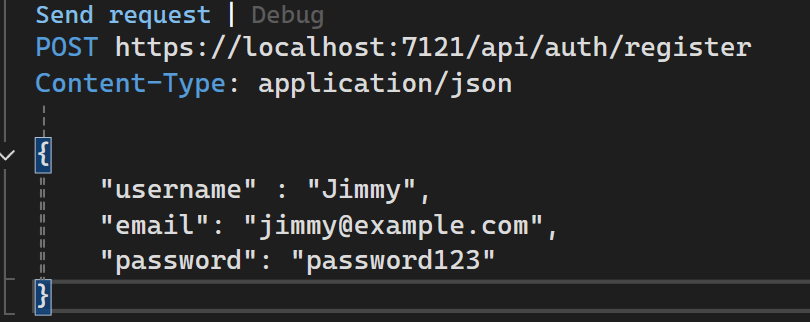

*POST /api/Auth/register – Successfully creates a new user*

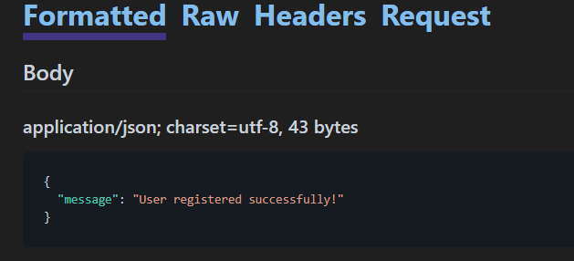

*Response message and user record saved in PostgreSQL*

### 2. User Login (JWT Authentication)
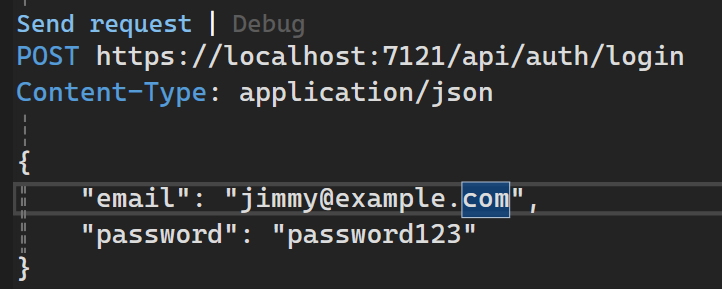

*POST /api/Auth/login – Returns JWT token*

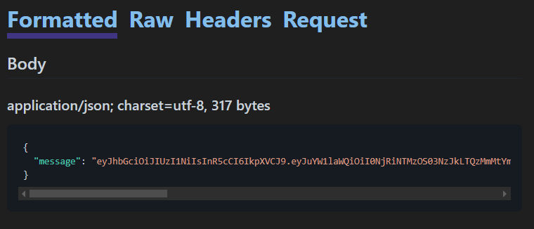

*JWT token received successfully*

### 3. Create Transaction (Protected Endpoint)
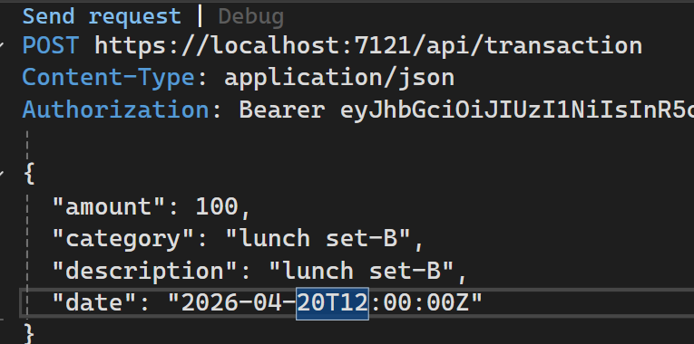

*POST /api/Transaction with Bearer Token authentication*

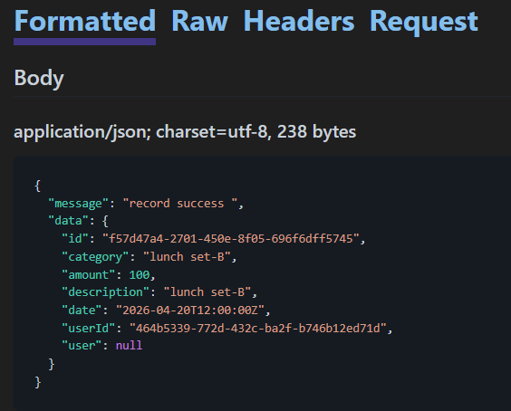

*Transaction record created successfully*

### 4. Database Verification
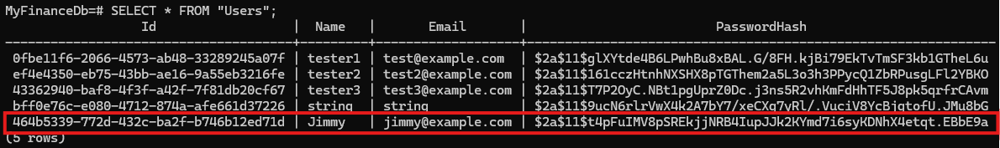
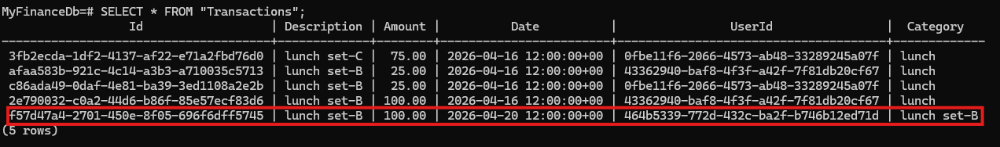

*Data correctly persisted in the database*

## Purpose
This project serves as a bridge between my previous experience in complex C# systems (Unity game development) and modern enterprise backend development. It showcases my ability to design scalable, testable, and production-ready APIs
